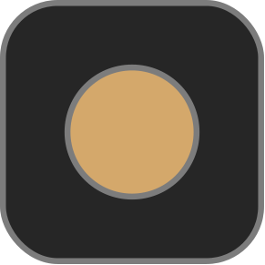

<p align="center">
  
</p>

<h1 align="center">Cracker</h1>

<p align="center">
  <strong>AI-powered chat experience</strong>
</p>

<p align="center">
  <a href="https://cracker.mom">cracker.mom</a>
</p>

---

<p align="center">
  <em>Multi-model • Reasoning • Real-time • Minimal</em>
</p>

---

### Quick Start

```bash
bun install
bun dev
```

---

<p align="center">
  <sub>Built with Next.js 16 • Vertex AI • Tailwind CSS</sub>
</p>
